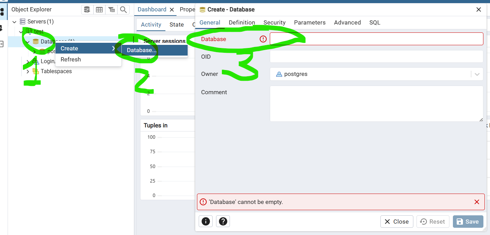

# ydhr77

## 🛠️ развертывание

### 1. Клонировать репозиторий:
```bash
git clone https://github.com/MrEnglishCat/yaon77.git 

cd yaon77

```

### 2. Дальше нужно установить на систему докер
https://docs.docker.com/engine/install/

### 3. После перехода в каталог проекта ```cd yaon77``` 
нужно запустить сборку и запуск всех контейнеров через docker-compose.yml


```
docker-compose up --build
```

### 4. PgAdmin работает на порту 8080 

http://localhost:8080

Заходим в него. 
```aiignore
username = admin@admin.com
password = admin
```
### 5. Далее нужно создать сервер через PgAdmin. 
    Далее по цифрам на скриншоте:
    1. Правая кнопка мыши на пункте Servers
    2. Пункт Register -> Server... - выбрать этот пункт Server
    3. В появившемся окне. Вкладка General  
        указать имя сервера: test (можно другое)
    4. Перейти во вкладку Connection
        заполнить поля со  скриншота:
            НАЗВАНИЕ                ЗНАЧЕНИЕ
            --------------------------------
            Host name/address:      db
            Port:                   5432
            Maintenance database:   postgres
            Username:               postgres
            Password:               postgres
    Далее нажимаем кнопку Save для сохранения данных. 


### 6. Нужно создать нужную базу данных (нумерация по цифрам на скриншоте)
    1. Нажать правой кнопкой мыши
    2. В контекстном меню выбрать Create -> Database... нажать
    3. Ввести имя базыданных: flask_db
    Далее нажать кнопку Save (Сохранить)


    
### 7. После этого нужно остановить контейнер и запустить его заново

```aiignore
    docker-compose down # остановка контейнера или Ctrl + C
    
    docker-compose up --build  # повторная сборка и запуск
    
    
```