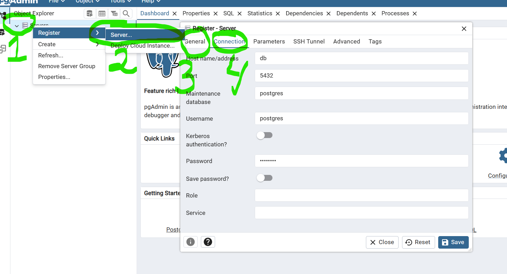

# ydhr77

## 🛠️ развертывание

### 1. Клонировать репозиторий:
```bash
git clone https://github.com/MrEnglishCat/yaon77.git 

cd yaon77

```

### 1.1 Создать .env и заполнить его
```aiignore
      # находясь в каталоге с проектом создать файл .env
      touch .env  # создание
      nano .env  # открыть для редактирования
      
      скопировать в файл 
      
            SQLALCHEMY_TRACK_MODIFICATIONS=False
            POSTGRES_USER=postgres
            POSTGRES_PASSWORD=postgres
            POSTGRES_DB=flask_db
            SQLALCHEMY_DATABASE_URI="postgresql://postgres:postgres@db/flask_db"
            
      сохранить файл 
      
```

### 2. Дальше нужно установить на систему докер
https://docs.docker.com/engine/install/

### 3. После перехода в каталог проекта ```cd yaon77``` 
нужно запустить сборку и запуск всех контейнеров через docker-compose.yml


```
docker-compose up --build
```
## Ниже что связано с PgAdmin - нужно только для просмотра базы данных. Для работы самого приложения он не нужен. 
После запуска контейнеров можно сразу переходить к пункту 6. На страницу Flask app.

### 4. PgAdmin работает на порту 8080 

http://localhost:8080

Заходим в него. 
```aiignore
username = admin@admin.com
password = admin
```
### 5. Далее нужно создать сервер через PgAdmin (если есть необходимость посмотреть БД через него). 
    Далее по цифрам на скриншоте после авторизации на странице http://localhost:8080:
    1. Правая кнопка мыши на пункте Servers
    2. Пункт Register -> Server... - выбрать этот пункт Server
    3. В появившемся окне. Вкладка General  
        указать имя сервера: test (можно другое)
    4. Перейти во вкладку Connection
        заполнить поля со  скриншота:
            НАЗВАНИЕ                ЗНАЧЕНИЕ
            --------------------------------
            Host name/address:      db
            Port:                   5432
            Maintenance database:   postgres
            Username:               postgres
            Password:               postgres
    Далее нажимаем кнопку Save для сохранения данных. 



### 6. Адреса страниц:
    http://localhost:8080  - PgAdmin
    http://localhost:8081  - web app Flask
    http://localhost:8082  - web app Flask доступ через Nginx